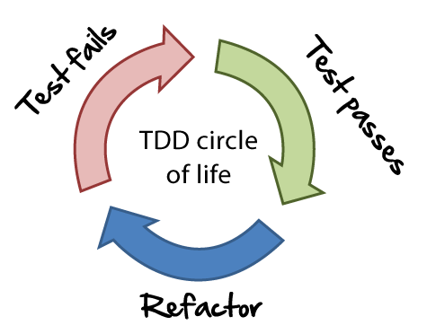
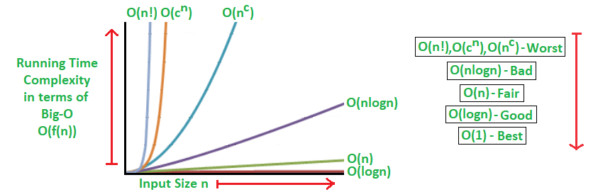

# Algoritmos, Estruturas de Dados e Clean Code :computer:

Nesse repositório irei incluir anotações e referências de estudo sobre algoritmos e seus desempenhos. Adicionando notas de práticas de Código Limpo. 

  

Acredito que é importante o conhecimento sobre boas práticas de desenvolvimento, desempenho computacional (utilização de memória e performance) ao escrever ou escolher um algoritmo, alguma biblioteca ou framework. 
 
Então, revendo alguns tópicos que foram abordados na universidade decidi deixar a memória mais fresca, melhorar a lógica de programação e criar um guia rápido para quando precisar. 

  <b> Aberto a colaboração</b>

 

---

## Conteúdo: 

### <b>Clean Code</b>
- [SOLID](SOLID/)
- [12-Fatores](https://12factor.net/pt_br/)
- [Guia para lidar com softwares legados](https://blog.geekhunter.com.br/lidando-com-codigo-legado/)
- [TDD](https://pt.wikipedia.org/wiki/Test-driven_development)
  - Deixar o software com uma ampla cobertura de testes é uma boa pratica para se seguir e estudar TDD faz com que você conheça formas de manter isso o mais natural possivel. Além dos testes, com o  TDD aprendemos a refatorar deixando o codigo sempre legivel e facil para manutenção.
  -  Livro: [Test-Driven Development - Teste e Design no Mundo Real](https://www.casadocodigo.com.br/products/livro-tdd)
  - Curso no Coursera: [Desenvolvimento de Software Guiado por Testes](https://www.coursera.org/learn/tdd-desenvolvimento-de-software-guiado-por-testes/)

  

  

---
### <b>Algoritmos</b>
- [Notação Big O](https://pt.khanacademy.org/computing/computer-science/algorithms/asymptotic-notation/a/big-o-notation)  

  - A notação Big O informa o quão rapido é um algoritmo. Não fornece o tempo em segundos, mas permite que você compare o numero de operações. Ela informa o quão  rapidamente um algoritmo cresce.

  

  
  
    
    
- [Recursividade](Recursividade/)

#### Busca:
- [Busca Binária](Busca/Binaria)

#### Ordenação

___

[Lucas Lacerda](https://www.linkedin.com/in/lucaaslb/)  :beer: :pizza: