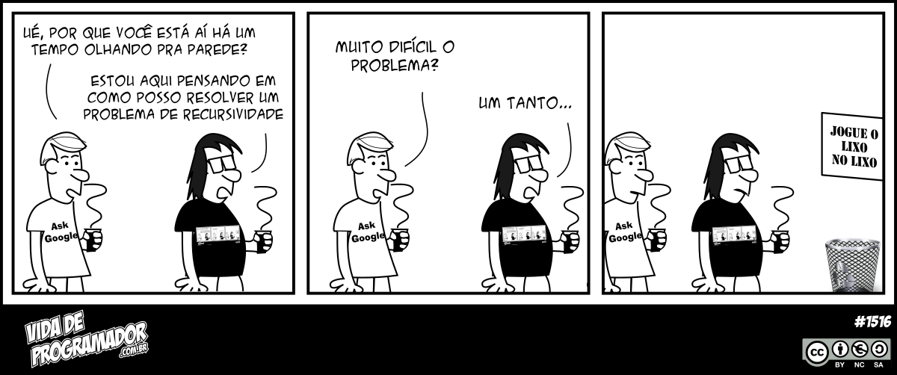

# Recursividade 

  

  

Recursão é um método de resolução de problemas que envolve quebrar um problema em subproblemas menores e menores até chegar a um problema pequeno o suficiente para que ele possa ser resolvido trivialmente. Normalmente recursão envolve uma função que chama a si mesma. Embora possa não parecer muito, a recursão nos permite escrever soluções elegantes para problemas que, de outra forma, podem ser muito difíceis de programar.

- [Me Salva - Recursão](https://www.youtube.com/watch?v=kS_VJYWeqIQ)

#### [Como os robôs de Asimov, todos os algoritmos recursivos devem obedecer três leis importantes:](https://panda.ime.usp.br/pythonds/static/pythonds_pt/04-Recursao/03-tresLeis.html)

- Um algoritmo recursivo deve possuir um *caso base*.

- Um algoritmo recursivo deve modificar o seu estado e se aproximar do caso base.

- Um algoritmo recursivo deve chamar a si mesmo, recursivamente.

A recursão é usada para tornar a resposta mais clara. Não há nenhum benefício quanto ao desempenho ao utilizar recursão. Na verdade os loops algumas vezes são melhor para o desempenho de um programa. ["Os loops podem melhorar o desempenho do seu programa. A recursão melhora o desempenho do seu programador. Escolha o que for mais importante para a sua situação."](https://stackoverflow.com/questions/72209/recursion-or-iteration/72694#72694) - Parágrafo retirado do livro "Entendendo algoritmos - Um guia ilustrado para programadores e outros curiosos". Recomendo muito a leitura.

---
Exemplos simples de recursão no arquivo [recusao.py](recursao.py)

Importante lembrar e entender:

- [Pilha de chamadas](https://developer.mozilla.org/pt-BR/docs/Glossario/Call_stack) (*call stack*)

- Dividir para conquistar (DC)

- Caso Base