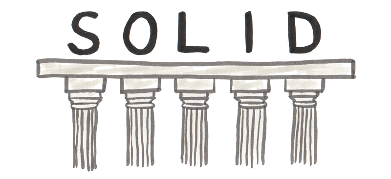

  

# S.O.L.I.D
## Princípios da Programação Orientada a Objetos

SOLID é um acrônimo que representa os cinco princípios da programação orientada a objetos e design de código teorizados pelo [Uncle Bob (Robert C. Martin)](https://pt.wikipedia.org/wiki/Robert_Cecil_Martin#cite_ref-unclebobconsultingllc_1-0). O acrônimo SOLID foi introduzido por [Michael Feathers](https://michaelfeathers.silvrback.com/), após observar que os cinco princípios poderiam se encaixar nesta palavra.  

___

- **Single Responsibility Principle (Principio da Responsailidade Unica)**

  - Uma classe deve ser especializada em um unico assunto e possuir apenas uma responsabilidade. 
  - A classe deve ter uma unica tarefa ou ação para executar.
  - A classe deve ter **coesão**. Classes coesas tendem a ser menores e mais simples, menos suscetíveis a problemas, reúso mais fácil e a chance de propagarem proble-
mas para outras classes é menor

- **Open/Closed Principle (Principio do Aberto/Fechado)**

  - Objetos ou entidades devem estar abertos para extensão, mas fechados para modificação.
  - Você deve ser capaz de estender um comportamento de uma classe sem alterar o codigo fonte original.
  - Tenha classes que são muito coesas e pouco **acopladas**.

- **Liskov Substitution Principle (Princípio da Substituição de Liskov)**

  - Uma classe derivada deve ser substituível por sua classe base. Seguir o LSP nos permite usar o polimorfismo com mais confiança. Podemos chamar nossas classes derivadas referindo-se à sua classe base sem preocupações com resultados inesperados.
  - O princípio da substituição de Liskov foi introduzido por [Barbara Liskov](https://en.wikipedia.org/wiki/Barbara_Liskov) em sua conferência “Data abstraction” em 1987.

- **Interface Segregation Principle (Princípio da Segregação de Interfaces)**
  - Uma classe não deve ser forçada a implementar interfaces e métodos que não irão utilizar. Muitas interfaces específicas são melhores do que uma interface única geral.

- **Dependency Inversion Principle (Princípio da Inversão de Dependências)**
  - "Abstrações não devem depender de detalhes. Detalhes devem depender de abstrações".
  - Dependa de abstrações e não de implementações.

___ 

#### Referências:
+ [The Principles of OOD - 	UncleBob](http://butunclebob.com/ArticleS.UncleBob.PrinciplesOfOod)
+ https://en.wikipedia.org/wiki/SOLID
+ [O que é SOLID: O guia completo para você entender os 5 princípios da POO](https://medium.com/joaorobertopb/o-que-%C3%A9-solid-o-guia-completo-para-voc%C3%AA-entender-os-5-princ%C3%ADpios-da-poo-2b937b3fc530)
+ [Alura - O que é Clean Code?](https://www.alura.com.br/artigos/o-que-e-clean-code)
+ [Orientação a Objetos e SOLID para Ninjas](https://www.casadocodigo.com.br/products/livro-oo-solid)

___
:beer: :pizza: